# Time Series Analysis of Hotel Data

This project analyzes monthly hotel visitor data from January 2009 onwards. The main goal is to explore time series properties, apply transformations, handle outliers, and develop forecasting models using different statistical techniques in R.

## Dataset

- **Source**: Local text file (`hotele.txt`)
- **Frequency**: Monthly
- **Start Date**: January 2009

## Workflow Overview

### 1. Data Preparation
- Load data using `read.table()`
- Convert to time series object with monthly frequency using `ts()`
- Visualize the original time series with `plot()` and `monthplot()`

#### Original Time Series
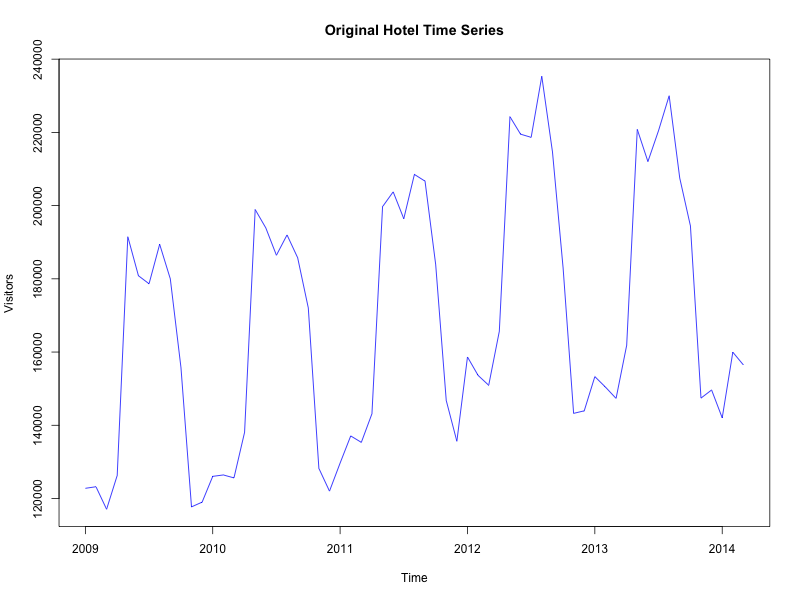

#### Monthplot
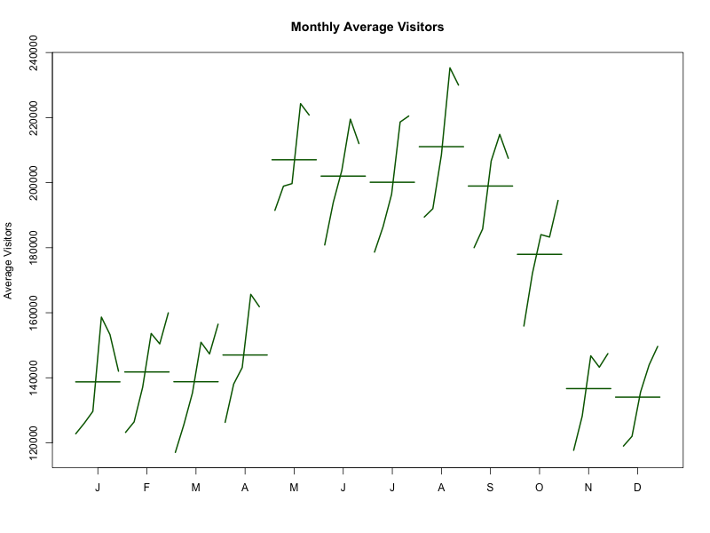

### 2. Seasonality and Autocorrelation Analysis
- Use `seasonplot()` to observe yearly seasonal patterns
- Apply `lag.plot()`, `acf()` and `pacf()` to identify autocorrelation structures
- Perform seasonal adjustment for unequal month lengths using `monthdays()`

#### Seasonal Plot by Year
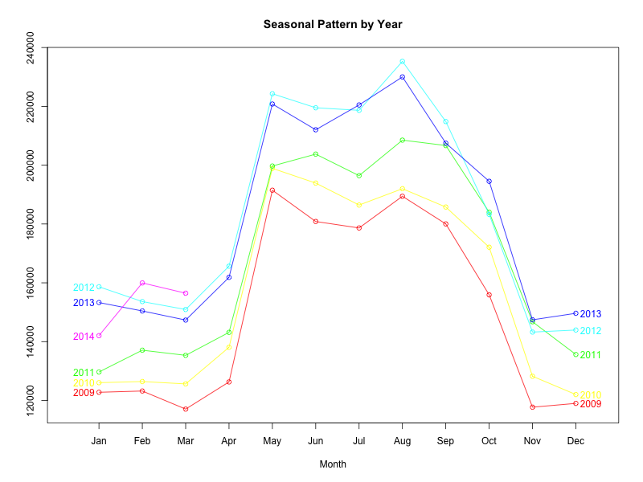

#### Lag Plot
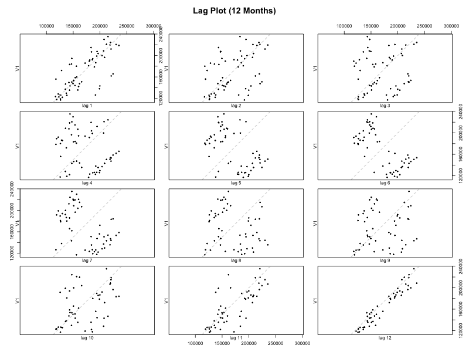

#### ACF and PACF
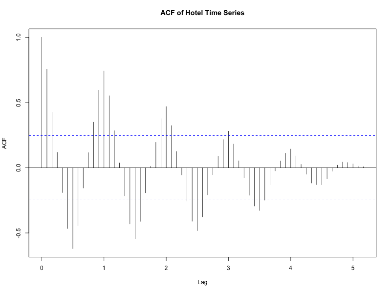
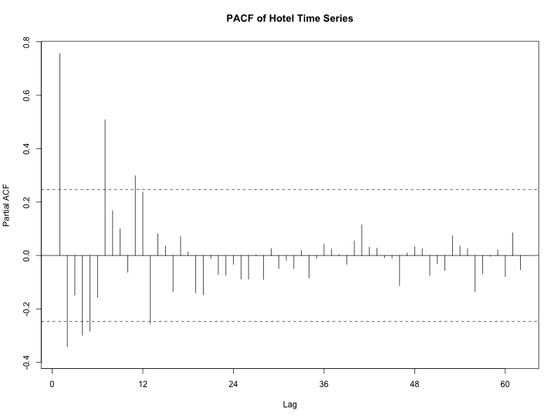

### 3. Outlier Detection and Cleaning
- Identify outliers with `tsoutliers()`
- Clean the time series using `tsclean()`

#### Cleaned Time Series with Outliers Removed
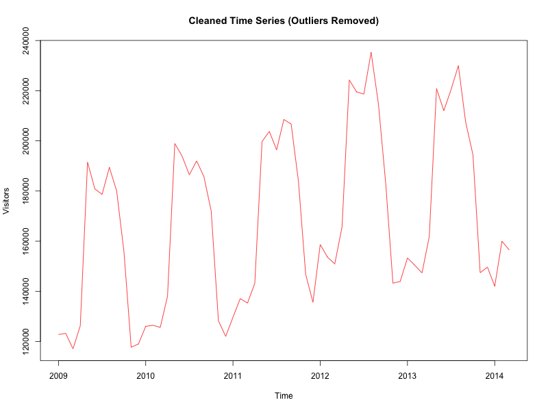

### 4. Data Aggregation and Disaggregation
- Aggregate data to quarterly using `aggregate()` with `sum` and `mean`
- Disaggregate back to monthly using the `tempdisagg` package with `td()` and `predict()`

#### Quarterly Aggregation (Sum)
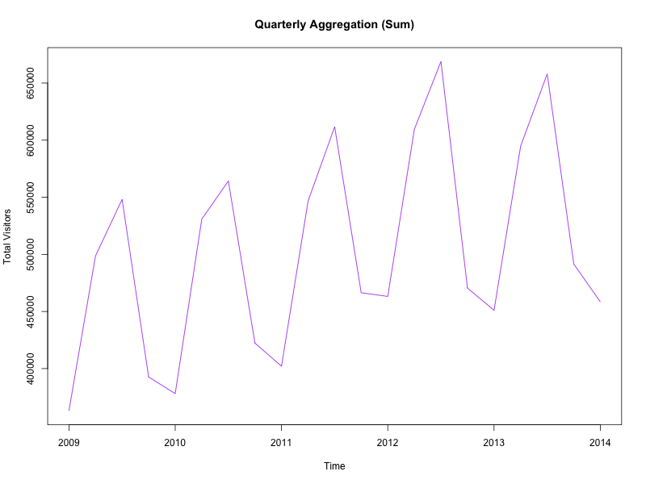

### 5. Modeling and Forecasting

#### TSLM Model (Trend + Seasonality)
- Split data into training (up to 2012) and testing (2013 onwards)
- Fit `tslm()` model to the training set
- Evaluate residuals for autocorrelation
- Forecast next 15 months with `forecast()`

#### Residual Modeling
- Fit Moving Average model (MA(13)) and Auto-Regressive model (AR(8)) to TSLM residuals
- Generate forecasts using `Arima()` and `forecast()`
- Combine with TSLM forecast

#### Comparison of Forecasts
- Compare:
  - TSLM forecast
  - TSLM + MA(13)
  - TSLM + AR(8)
- Plot actual vs. predicted values

#### TSLM Forecast
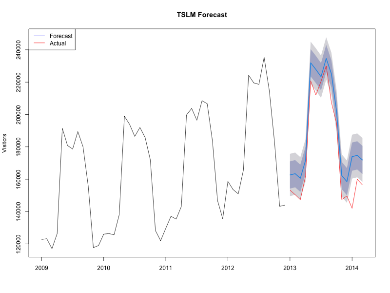
 
#### TSLM + MA(13) Forecast
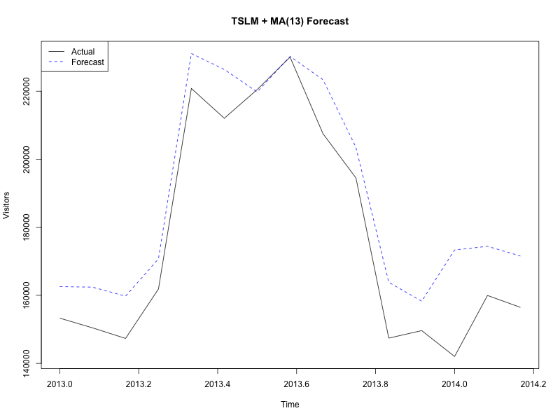

#### TSLM + AR(8) Forecast
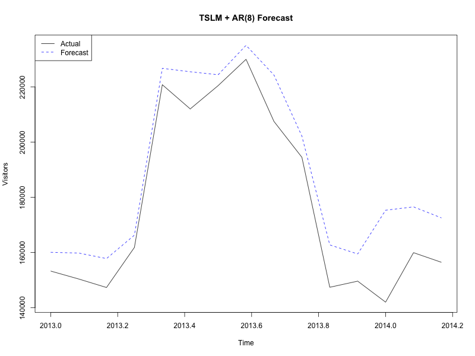

#### Auto-ARIMA
- Use `auto.arima()` on TSLM residuals for model selection

#### Auto-ARIMA Forecast

# Key Findings

- The hotel data exhibits strong monthly seasonality.
- First-order seasonal differencing is necessary to remove seasonality.
- TSLM model effectively captures trend and seasonal components.
- Residuals show autocorrelation, which can be further modeled with AR(8) or MA(13).
- Combining TSLM with AR/MA models improves forecast accuracy.
- `auto.arima()` provides an efficient way to identify optimal residual models.

## Requirements

- **R**
- **Packages**: `forecast`, `tempdisagg`, `tseries`
